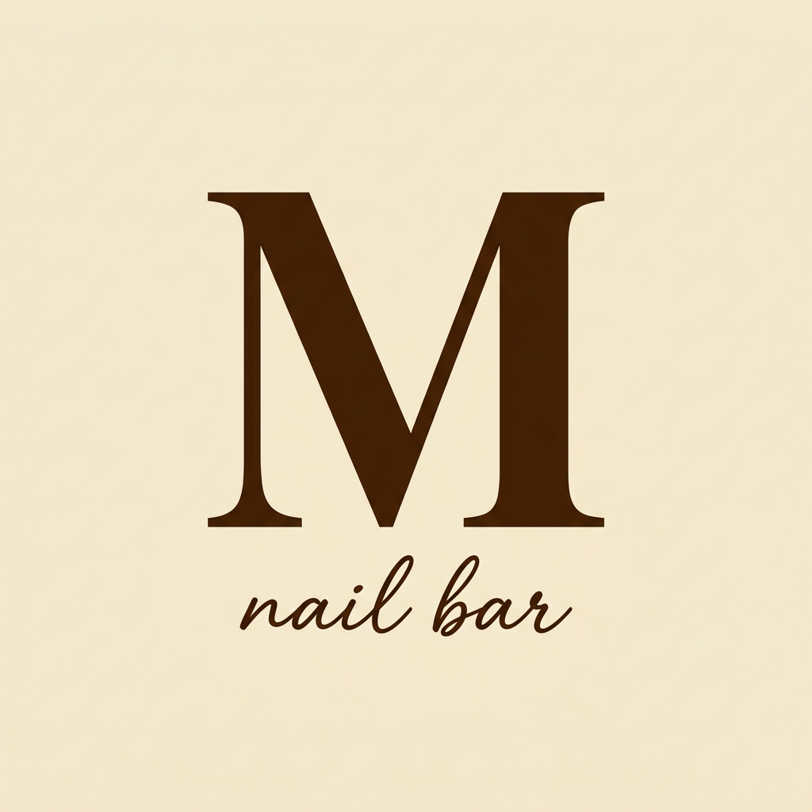

<p align="center">
  
</p>

<h1 align="center">Mikita Nail Bar</h1>

<p align="center">
  <strong>Cotizador de servicios en tiempo real</strong><br/>
  PWA mobile-first para que las empleadas del salón coticen servicios y envíen presupuestos por WhatsApp al instante.
</p>

<p align="center">
  
  
  
  
</p>

---

## ✨ Funcionalidades

- **🔢 Multi-servicio** — Seleccioná uno o varios servicios de 9 categorías distintas (Manos, Pedicuría, Cejas, Pestañas, etc.)
- **💅 Diseñador de uñas** — Selector visual de 10 uñas para asignar decoraciones individuales (Nail Art, Francesitas, Deco x 2, etc.)
- **📊 Cálculo en tiempo real** — El total se actualiza instantáneamente al agregar servicios, decoraciones, remociones y extras
- **📱 Envío por WhatsApp** — Genera un mensaje pre-formateado y abre `wa.me` con un solo toque
- **📋 Copiar al portapapeles** — Alternativa para pegar el presupuesto donde quieras
- **🔧 Panel Admin** — Edición de precios, historial de presupuestos e inventario de insumos
- **📡 Offline-first** — Service Worker con cache para funcionar sin conexión
- **🍎 Optimizada para iOS** — Safe-area insets, standalone mode, prevención de zoom

## 🖼️ Screenshots

<p align="center">
  <em>Selector de servicios → Diseñador de uñas → Resumen y WhatsApp</em>
</p>

## 🚀 Getting Started

### Requisitos

- [Node.js](https://nodejs.org/) v18+
- npm

### Instalación

```bash
# Clonar el repositorio
git clone https://github.com/tu-usuario/mikita-app.git
cd mikita-app

# Instalar dependencias
npm install

# Iniciar servidor de desarrollo
npm run dev
```

Abrir [http://localhost:3000](http://localhost:3000) en el navegador.

### Build de producción

```bash
npm run build
npm start
```

## 🏗️ Tech Stack

| Tecnología | Uso |
|---|---|
| **Next.js 16** | Framework React con App Router |
| **Tailwind CSS v4** | Design system CSS-first con `@theme inline` |
| **LocalStorage** | Persistencia offline de precios, historial e inventario |
| **Service Worker** | Cache network-first para PWA offline |
| **Google Fonts** | Inter (UI) + Dancing Script (branding) |

## 📁 Estructura del Proyecto

```
mikita-app/
├── public/
│   ├── icons/              # Iconos PWA
│   ├── manifest.json       # PWA manifest
│   └── sw.js               # Service Worker
├── src/
│   ├── app/
│   │   ├── layout.js       # Root layout + fonts + meta tags
│   │   ├── page.js         # Cotizador principal
│   │   ├── globals.css     # Design system Tailwind v4
│   │   └── admin/page.js   # Panel de gestión
│   ├── components/
│   │   ├── Header.jsx
│   │   ├── ServiceSelector.jsx
│   │   ├── NailDesigner.jsx
│   │   ├── ExtrasSelector.jsx
│   │   ├── QuoteSummary.jsx
│   │   └── WhatsAppSection.jsx
│   ├── data/
│   │   └── services.json   # Catálogo de servicios y precios
│   └── lib/
│       ├── formatters.js   # Formato ARS + teléfonos
│       ├── whatsapp.js     # Generador de mensajes + links wa.me
│       └── storage.js      # Helpers de LocalStorage
```

## 🎨 Paleta de Colores

| Color | Hex | Uso |
|---|---|---|
| 🟫 Cream | `#F5EEDC` | Fondo principal |
| 🟤 Chocolate | `#4D290A` | Textos, botones, acentos |
| 🫘 Cocoa | `#8C6F5A` | Detalles secundarios |
| 🥇 Accent | `#C9A96E` | Highlights y precios |

## 🗺️ Roadmap

- [x] **Fase 1** — MVP Cotizador offline con LocalStorage
- [ ] **Fase 2** — Integración con Supabase (base de datos en la nube, sync en tiempo real)
- [ ] **Fase 3** — Reportes y estadísticas de ventas
- [ ] **Fase 4** — Sistema de turnos y agenda

## 🤝 Contribuir

Las contribuciones son bienvenidas. Por favor leé [CONTRIBUTING.md](CONTRIBUTING.md) antes de enviar un PR.

## 📄 Licencia

Este proyecto está bajo la licencia MIT. Ver [LICENSE](LICENSE) para más detalles.

---

<p align="center">
  Hecho con 🤎 por <strong>Mikita Nail Bar</strong>
</p>
